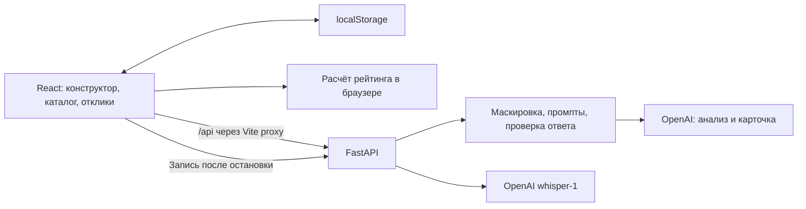

# Qadam AI

Qadam AI помогает представителю бизнеса превратить короткое описание проблемы в понятную задачу для студенческих команд. ИИ задаёт уточняющие вопросы и собирает редактируемую карточку. Бизнес дополняет и подтверждает её, видит рейтинг готовности и публикует в каталоге. Студенты отправляют предложения, а бизнес самостоятельно выбирает исполнителей.

Геймификация направлена на бизнес: полнота описания повышает рейтинг и позицию задачи. Низкий рейтинг не закрывает доступ к задаче и не запрещает отклики.

**Репозиторий:** [BAITC-Hacks / Qadam AI](https://github.com/BAITC-Hacks/hack-e23c8ea3-qadam-ai).

**Жюри: начните здесь.** [Установка и запуск](#start) → [демонстрация по шагам](#jury) → [результаты проверок](#checks). [Архитектура](#architecture) и формула рейтинга описаны ниже.

**Ключ API для жюри.** Ключ OpenAI, выданный организаторами хакатона, **намеренно добавлен в Git в `.env.example`** для проверки проекта жюри. Это согласованное решение команды, а не ошибка или случайная публикация. Скопируйте шаблон в локальный `.env` по инструкции запуска. Ключ используется только backend; его значение в README не дублируется.

Ссылка на демо роликҒ
https://drive.google.com/file/d/1OuhPMb4sXXmjUwoYFYaZ2_nuFYbOYrRN/view?usp=sharing

## 1. Что реализовано

- Конструктор: свободный черновик и отрасль → 3–5 вопросов → редактируемая карточка → ручное подтверждение и публикация. Frontend подключён к настоящему AI backend.
- Бизнес-консультант: «хочу денег» запускает вопросы об опыте, аудитории и ресурсах. Посторонняя тема получает объяснение границ; сообщение о личном кризисе — отдельный ответ поддержки под полем ввода. Карточка для таких отказов не создаётся.
- Голосовой ввод черновика и каждого ответа через OpenAI Whisper, с остановкой и отменой. Текст можно исправить до дальнейшего использования.
- Рейтинг 0–100, расшифровка баллов, подсказки о возможном приросте и история изменения рейтинга.
- Каталог всех опубликованных задач, сортировка, поиск, фильтры по отрасли и уровню, рекомендации по навыкам и интересам.
- Отклики команд: идея, план, срок, ссылка на прототип. Бизнес вручную выбирает одну, несколько или ни одной команды.
- Подтверждённый этап принятой команды даёт +50 баллов один раз на отклик.
- Три демонстрационных профиля бизнеса, пять команд, переключение ролей, интерфейс RU / KK / EN, светлая/тёмная/системная тема.
- Сохранение демонстрационной сессии в `localStorage`, восстановление после перезагрузки и сброс демо.

При недоступном AI ввод и текущий шаг сохраняются, показывается сообщение. Автоматическая генерация через локальную заглушку отключена. Вопросы и сообщения backend пока формируются на русском независимо от языка интерфейса.

## 2. Пользовательский сценарий

1. Представитель бизнеса выбирает профиль, вводит черновик и отрасль.
2. ИИ анализирует описание и задаёт уточняющие вопросы.
3. Бизнес отвечает текстом или голосом; ИИ собирает карточку.
4. Бизнес проверяет факты и редактирует поля; предварительный рейтинг пересчитывается.
5. После ручного подтверждения задача публикуется в общем каталоге текущей демо-сессии.
6. Студенческая команда открывает задачу и отправляет предложение.
7. Бизнес сравнивает отклики и вручную принимает или отклоняет их.
8. После выполненного этапа бизнес подтверждает результат принятой команды; ей начисляется +50 баллов.

Это демонстрация ролей в одном браузере, а не многопользовательский сервис с общей серверной базой.

## 3. Технологии

| Часть | Реализация |
|---|---|
| Frontend | JavaScript/JSX, React 19, React DOM, Vite 8 |
| Интерфейс | Tailwind CSS 4, lucide-react, собственные компоненты и переводы |
| Backend | Python 3.11+, FastAPI, Uvicorn, Pydantic |
| AI-конструктор | OpenAI SDK, Chat Completions, Structured Outputs; модель задаётся через `OPENAI_MODEL` |
| Распознавание речи | `MediaRecorder` в браузере и модель `whisper-1` на backend |
| Конфигурация | Переменные окружения и `python-dotenv` |
| Хранение | React state и браузерный `localStorage` |
| Проверки | pytest, TestClient/HTTPX, Ruff, встроенный `node:test`, Oxlint |

В сохранённом живом прогоне использовалась `gpt-5.4-mini`. Она не зашита как обязательная модель в код конструктора: доступ к выбранной модели зависит от аккаунта OpenAI. Backend-зависимости перечислены в `backend/requirements.txt`, инструменты разработчика — в `backend/requirements-dev.txt`; frontend фиксируется через `front/package-lock.json`.

<a id="architecture"></a>

## 4. Архитектура



Backend обслуживает AI-запросы; задачи, команды, отклики и баллы на сервере не хранятся. Публикация и выбор команды выполняются во frontend. Навигация использует состояние приложения и адреса `#/builder`, `#/catalog`, `#/proposals`, `#/mine` с учётом выбранной роли.

Основные файлы:

```text
front/src/store/useQadam.jsx       состояние и действия приложения
front/src/features/builder/       черновик, вопросы, редактор, голосовой ввод
front/src/features/catalog/       каталог и форма отклика
front/src/features/proposals/     решения бизнеса и подтверждение этапа
front/src/lib/scoring.js          рейтинг и подсказки
front/src/lib/catalog.js          правила каталога, откликов и этапов
front/src/lib/api.js              действующий HTTP-клиент конструктора
front/src/lib/constructorAI.js    проверка AI-ответов без fallback
front/src/lib/voice.js            запись, отмена и распознавание
front/src/data/seed.js            начальные данные интерфейса
backend/app/main.py              FastAPI, health, обработчики ошибок
backend/app/services/constructor.py  обработка AI-конструктора
backend/app/prompts/             действующие промпты анализа и карточки
backend/app/llm.py               клиент OpenAI и загрузка промптов
backend/app/contact_context.py   правила дат и явного денежного контекста
backend/app/routers/voice.py     ограниченный по размеру приём аудио
backend/app/services/voice.py    обращение к Whisper
```

## 5. Рейтинг и правила каталога

Рейтинг рассчитывается кодом, без участия LLM. Для текстового поля качество `q` равно 0 при пустом значении, 0,35 при 1–3 словах, 0,7 при 4–9 словах и 1 при 10 и более словах. Слова разделяются пробельными символами.

| Критерий | Вес | Расчёт качества |
|---|---:|---|
| Контекст и потребность | 20 | Среднее `q(context)` и `q(need)` |
| Данные и материалы | 20 | `q(data)` |
| Ожидаемый результат | 15 | `q(result)` |
| Критерии успеха | 15 | `q(criteria)`, но не больше 0,6 без цифр |
| Ограничения | 10 | `q(constraints)` |
| Пользователи | 10 | `q(users)` |
| Связь с бизнесом | 10 | `0,6 × q(contact) + 0,4 × q(format)`; `q(contact)` ограничивается 0,5, если канал связи не распознан |

Каждый критерий: `Math.round(вес × качество)`. Сумма — от 0 до 100. До подтверждения это предварительная оценка; в каталог попадает подтверждённая карточка.

Уровни: 0–39 — «Черновик», 40–69 — «Рабочая», 70–89 — «Готовая», 90–100 — «Приоритетная». Это эвристика заполненности, а не проверка истинности или полезности текста. Повторение бессодержательных слов тоже может дать высокий балл.

Каталог сортируется по рейтингу, при равенстве — по времени создания (`Date.now()` для новых задач). Рекомендации содержат до трёх задач с рейтингом от 40 и совпадениями тегов/навыков или отрасли/интересов. Они не ограничивают общий каталог. Одна команда может отправить один отклик на задачу; общего лимита числа команд нет. Выбор и начисление баллов за этап не происходят автоматически.

<a id="start"></a>

## 6. Установка и запуск

Нужны Git, Python 3.11+ и Node.js, совместимый с Vite: `^20.19.0 || >=22.12.0`. Проверки выполнялись на Python 3.12 и Node.js 24.19.0. Для реального AI нужны интернет и действующий ключ OpenAI с доступом к выбранной модели.

### Подготовка

```bash
git clone https://github.com/BAITC-Hacks/hack-e23c8ea3-qadam-ai.git
cd hack-e23c8ea3-qadam-ai
git log -1 --oneline
```

Код приложения проверен на коммите `10337ec` от 23 сентября 2026 года, включая исправления обработки дат/телефонов и переходов из трекера. Результаты приведены в разделе 9; последующие изменения требуют проверки затронутых сценариев.

Создайте `.env` в корне репозитория, сохранив уже существующий файл:

```bash
test -e .env || cp .env.example .env
```

В `.env.example` намеренно сохранён выданный организаторами ключ для проверки жюри. Его наличие в Git согласовано командой и не является ошибкой; значение здесь не дублируется. Копирование шаблона создаёт конфигурацию для этого сценария, но работоспособность и доступность квоты проверяются реальным вызовом. Существующий `.env` команда выше не меняет: проверьте в нём наличие непустых `OPENAI_API_KEY`, `OPENAI_MODEL` и `AI_MODE=auto`.

Если используете собственный ключ, заполните файл локально в редакторе. Названия переменных:

```dotenv
OPENAI_API_KEY=
OPENAI_MODEL=gpt-5.4-mini
AI_MODE=auto
```

В примере значение `OPENAI_API_KEY` намеренно скрыто: не заменяйте действующий ключ пустой строкой. Собственный ключ храните только в локальном окружении. `AI_MODE=stub` выключает AI на backend; это не включение автоматической заглушки frontend. Whisper использует ключ и `AI_MODE=auto`, но не зависит от `OPENAI_MODEL`.

### Терминал 1 — backend

Из корня репозитория:

```bash
cd backend
python3.12 -m venv .venv
source .venv/bin/activate
python -m pip install -r requirements.txt
python -m uvicorn app.main:app --host 127.0.0.1 --port 8000
```

Если используете Python 3.11, замените `python3.12` на `python3.11`. Терминал оставьте открытым. После изменения `.env` перезапустите backend.

### Терминал 2 — frontend

Откройте новый терминал и перейдите в корень того же репозитория:

```bash
cd front
npm ci
npm run dev -- --host 127.0.0.1 --port 5173 --strictPort
```

Откройте **http://127.0.0.1:5173**. Vite проксирует `/api` на backend. Если порт 8000 занят, запустите backend с `--port 8017`, а frontend командой:

```bash
QADAM_API_TARGET=http://127.0.0.1:8017 npm run dev -- --host 127.0.0.1 --port 5173 --strictPort
```

Остановка серверов — `Ctrl+C` в соответствующих терминалах. Команды выше предназначены для локального демо, не для публичного размещения.

### Проверка соединения

```bash
curl http://127.0.0.1:5173/api/health
```

Ожидаются `ok: true`, `ai_available: true`, `openai_key: true`, `ai_mode: "auto"` и выбранная `model`. `openai_key` — булев признак, не ключ. Эти признаки подтверждают настройки, но не работоспособность ключа: реальный вызов проверяется следующим сценарием. Swagger UI: **http://127.0.0.1:8000/docs**.

<a id="jury"></a>

## 7. Пошаговая инструкция для жюри

Обязательная демонстрация по ТЗ — работа в приложении: слабый черновик → уточнения → рост рейтинга → публикация → отклик → ручное решение бизнеса. Начинайте с этого пути. Подтверждение этапа с +50 можно показать после основного сценария. Предельные пять минут требуют отдельной репетиции; приведённая инструкция не означает, что такой прогон уже выполнен.

### Перед началом

Убедитесь, что backend и frontend запущены по разделу 6, а `/api/health` показывает непустую модель и доступную конфигурацию AI. Без `OPENAI_MODEL` конструктор не сможет пройти анализ и сборку. Откройте приложение, выберите русский язык, роль «Бизнес», профиль **Qala Service** и экран «Новая задача». Для чистого старта нажмите «Сбросить демо» внизу боковой панели: сохранённые изменения будут заменены начальными данными. Профиль бизнеса во время заполнения одной карточки не переключайте.

Трекер **«Сквозной сценарий»** отслеживает последнюю опубликованную задачу. Шаги 1–5 проходит бизнес; шаги 6–8 засчитываются только по откликам и этапу этой задачи. Отклик на другую задачу не продвигает этот сценарий. До завершения демонстрации не публикуйте вторую задачу.

Трекер показывает название отслеживаемой задачи и подсказывает следующее действие. После публикации кнопка «Открыть задачу как студент» открывает именно эту задачу; затем «Перейти к откликам» возвращает к её предложениям от профиля бизнеса-владельца. Ручной путь через переключатель «Бизнес» / «Студенты» и экран «Отклики» также доступен.

### Шаг 1. Слабый черновик

Выберите отрасль **HoReCa** и вставьте:

> У нас небольшая пекарня. Хотим меньше списывать непроданную выпечку в конце каждого рабочего дня.

Нажмите «Продолжить с помощником». Ожидаются 3–5 уточняющих вопросов. В инструментах разработчика браузера, Network, можно проверить `POST /api/constructor/analyze`, HTTP 200 и `source: "ai"`. Если запрос завершился ошибкой, это не успешный AI-шаг: исправьте настройки и повторите.

### Шаг 2. Уточняющие ответы

Заполняйте ответы по смыслу показанных вопросов. Формулировки и выбор полей могут меняться:

| Поле | Подготовленный ответ |
|---|---|
| Потребность | Хотим сократить списания и планировать количество выпечки на следующий день. |
| Данные | Предоставим обезличенную таблицу продаж и списаний по видам выпечки за месяц. |
| Результат | Ожидаем таблицу с рекомендациями по количеству выпечки на следующий день. |
| Критерии | Сравним расчёты с ручным подсчётом. |
| Пользователи | Владелец пекарни и пекарь. |
| Ограничения | Срок две недели, только обезличенные таблицы. |
| Контакт | bakery-demo@example.com |

Ответьте на каждый показанный вопрос. Рейтинг справа пересчитывается по мере заполнения: не каждое добавленное слово обязательно повышает балл, поскольку формула использует пороги полноты. Нажмите «Собрать карточку».

### Шаг 3. Проверка карточки

Ожидается редактор; `/api/constructor/card` возвращает HTTP 200 и `source: "ai"`. Проверьте, что факты не придуманы. Неизвестные поля должны остаться пустыми, а замечания — видимыми.

### Шаг 4. Рост рейтинга и подтверждение

Назовите задачу **«План выпечки — проверка жюри»**. Дополните карточку:

- Потребность: «Нужно сократить списания выпечки с помощью планирования ежедневного выпуска на завтра».
- Пользователи: «Рекомендациями будут пользоваться владелец пекарни и пекарь при планировании ежедневного выпуска».
- Критерии: «На контрольных данных сумма списаний совпадает с ручным подсчётом в 100% строк».
- Ограничения: «Прототип нужно подготовить за четырнадцать дней, используя только обезличенные таблицы бизнеса».
- Контакт: `bakery-demo@example.com`.
- Формат взаимодействия: «Один видеозвонок по пятницам, обратная связь письмом в течение двух рабочих дней».

Проверьте данные и результат; если ИИ не спрашивал о них, внесите подготовленные сведения из таблицы выше в редактор. Покажите изменение рейтинга и его расшифровку. Точный исходный балл зависит от AI-текста. Поставьте галочку «Я проверил карточку». Изменение любого поля карточки снимает подтверждение; перед публикацией его нужно поставить снова.

### Шаг 5. Публикация

Нажмите «Опубликовать». Задача появляется в каталоге с рассчитанным рейтингом, позицией и меткой «Новая». Найдите её по названию; трекер должен показывать **5/8**. Задачи уровня «Черновик» тоже доступны студентам и допускают отклики.

### Шаг 6. Два отклика

Нажмите в трекере «Открыть задачу как студент» либо вручную переключитесь в роль «Студенты» и откройте свою новую задачу в каталоге. Выберите команду **Data Batyrs** и заполните:

- Идея: «Подготовим рекомендации на основе продаж и списаний по дням».
- План: «Проверим данные, выполним расчёты и сравним результат с ручным подсчётом».
- Срок: «7 дней после получения данных».
- Ссылка: `https://example.com/prototypes/bakery-data`.

Отправьте предложение. Затем выберите **Pixel Qanat**, откройте ту же задачу и отправьте второй отклик с идеей веб-интерфейса, планом реализации, сроком «10 дней после получения данных» и ссылкой `https://example.com/prototypes/bakery-web`.

Это синтетические ссылки для проверки формы, не готовые прототипы. Для демо используйте `https://`; текущая валидация также допускает корректный `http://` с доменом. Оба отклика должны иметь статус «На рассмотрении». После первого отклика на эту задачу трекер показывает **6/8**.

### Шаг 7. Ручное решение

Нажмите в трекере «Перейти к откликам» либо вручную вернитесь в «Бизнес», профиль **Qala Service**, экран «Отклики» и выберите новую задачу. Для Data Batyrs нажмите «Выбрать», для Pixel Qanat — «Отклонить». Решение по одному отклику не должно менять второй. Автоматического назначения команды нет. Трекер показывает **7/8**; для этого достаточно ручного решения по хотя бы одному отклику своей новой задачи, в том числе отклонения.

### Шаг 8. Этап и сохранение

После условного выполнения этапа нажмите «Подтвердить этап → +50 баллов команде» у принятой Data Batyrs. Команда получает +50 баллов один раз: в чистом seed её 90 баллов становятся 140. Повторное начисление блокируется. Трекер показывает **8/8**. Перезагрузите страницу и проверьте сохранение задачи, решений, баллов и прогресса в том же браузере. Для повторного полного прохода нажмите «Сбросить демо».

### Дополнительные проверки

| Действие | Ожидаемое поведение |
|---|---|
| Пустой черновик | Анализ не запускается; прямой API-запрос получает 422 |
| «хочу денег» | Вопросы об опыте, аудитории и ресурсах |
| «расскажи анекдот» | Объяснение границ бизнес-темы, без карточки |
| Синтетическое «хочу умереть» | Сообщение поддержки под вводом, без бизнес-вопросов |
| Не подтвердить карточку | Публикация недоступна |
| Пустое название карточки | Публикация отклоняется |
| Пустая идея, план или срок отклика | Ошибка соответствующего поля; минимального количества слов нет |
| Ссылка без `http://` или `https://` | Ошибка ссылки |
| Повторный отклик той же команды | Отклоняется |
| Остановить backend и запросить AI | Ошибка с сохранением ввода; локальная карточка не генерируется |

Голосовой ввод проверяется отдельно: нажмите кнопку микрофона, дайте разрешение, произнесите синтетический текст, остановите запись и проверьте добавление текста. Одновременно работает одна запись/расшифровка. Максимум записи — 60 секунд и 5 МиБ; по достижении 60 секунд запись автоматически отправляется. Отмена останавливает локальное ожидание, но не отзывает уже отправленное аудио у провайдера. Нужны HTTPS либо localhost и поддержка MediaRecorder.

## 8. API, данные и интеграции

| Метод | Маршрут | Вход → результат |
|---|---|---|
| GET | `/api/health` | Признаки конфигурации AI |
| POST | `/api/constructor/analyze` | `{draft, industry}` → `{detected, missing, questions, source}` |
| POST | `/api/constructor/card` | `{draft, industry, answers}` → `{card, warnings, source}` |
| POST | `/api/voice/transcribe` | Сырое аудио → `{text}` |

Черновик должен быть непустым; ограничение «минимум три слова» больше не действует. Ключи answers: `need`, `users`, `data`, `constraints`, `result`, `criteria`, `contact`. Публичная карточка содержит строковые `title`, `industry`, `context`, `need`, `users`, `data`, `constraints`, `result`, `criteria`, `contact`, `format`.

Действующие полные промпты: `backend/app/prompts/analyze.md` и `backend/app/prompts/card.md`. Анализ различает бизнес-задачу, предварительное бизнес-намерение, постороннюю тему и потребность в поддержке. Для бизнес-сценария он возвращает 3–5 вопросов с неповторяющимися полями; сборка использует только факты черновика и ответов. Внутренний `intent` проверяет сервер; в публичный ответ он не включается. Контакт восстанавливает сервер, а не модель.

Успешные ответы конструктора имеют `source: "ai"`. Ошибки — `{"error": "..."}`; 422 применяется также для остановки вне темы, сообщения поддержки и просьбы уточнить бизнес-идею. После ошибки провайдера/валидации сервис делает не более одного повтора, затем возвращает 503. Клиент ждёт до 45 секунд; SDK использует тайм-аут 20 секунд на сетевые операции, что не является гарантированным общим пределом двух вызовов.

Голосовой маршрут принимает `audio/webm`, `audio/mp4`, `audio/wav`, `audio/x-wav`, `audio/mpeg`, до 5 МиБ; ошибки содержат `error` и `code`. Распознавание ограничено общим тайм-аутом 20 секунд без повторов, frontend ждёт до 30 секунд.

Рабочие данные интерфейса — `front/src/data/seed.js`: 5 черновиков, 5 задач, 5 команд, 5 откликов и 3 профиля бизнеса. Исходные рейтинги задач: 98, 78, 88, 48, 21. Баллы рассчитываются из полей, не доверяются сохранённому числу.

`seed/*.json`, `DEMO.md` и `demo-inputs.json` не загружаются приложением автоматически. В опубликованном снимке эти материалы частично относятся к старому контракту; для проверки используйте сценарий этого README и рабочий frontend seed.

Внешние сервисы — OpenAI и Google Fonts. Нет действующих интеграций с CRM, 1С, CSV/Excel-хранилищами: упоминания таких источников — текст задач, а не загрузка и обработка таблиц платформой.

Контактный ответ не передаётся модели. Распознаваемые контакты остальных полей маскируются локально и восстанавливаются сервером. На backend исправлены телефоны с точками, сбор контакта из неконтактных ответов, ошибочное распознавание явно обозначенного бюджета и обработка дат рядом с телефонами. Регрессионные тесты проверяют также сохранение даты со временем при маскировании. Маскировка не является полной анонимизацией. Аудио до отправки в OpenAI не обезличивается; для демо используйте только синтетические сведения. Приложение не сохраняет аудио на диск, но транскрипция сохраняется как обычный текст в браузере.

<a id="checks"></a>

## 9. Автоматические проверки и фактические результаты

Из `backend/`:

```bash
source .venv/bin/activate
python -m pip install -r requirements-dev.txt
python -m pytest tests -q
python -m ruff check --no-cache app tests
python -m pip check
```

Из `front/`:

```bash
npm test
npm run lint
npm run build
npm audit
```

На снимке `10337ec` 23 сентября прошли **211 backend-тестов и 141 frontend-тест**, Ruff и сборка успешны. Oxlint — без ошибок, 7 предупреждений Fast Refresh/setState в effect. Ранее в тот же день `pip check` подтвердил совместимость установленных Python-зависимостей, а `npm audit` не нашёл известных уязвимостей в lockfile; файлы зависимостей с тех пор не менялись. Это не гарантия отсутствия всех уязвимостей.

Backend-тесты подменяют провайдера. Ранее сохранён живой прогон `gpt-5.4-mini`: 19 синтетических примеров, 38 операций анализа/сборки, один повтор после тайм-аута и без окончательных ошибок. Все 9 решений о границах темы соответствовали ожиданиям, но остались смысловые замечания к вопросам и отдельным полям. SHA-256 текущих промптов совпадает с сохранённым прогоном. Исходные ответы: `docs/constructor-checks/2026-09-23/`, ручная оценка: `docs/constructor.md`. После BE-01–BE-03 и последующих исправлений обработки дат/телефонов серверные регрессии проверены с подменой SDK; новый платный прогон не выполнялся.

Для повторной живой оценки из `backend/`, с настроенным ключом:

```bash
python -m tests.manual_constructor --suite quality --live > /tmp/qadam-quality.json
python -m tests.manual_constructor --suite security --live > /tmp/qadam-security.json
python -m tests.manual_constructor --suite scope --live > /tmp/qadam-scope.json
```

Это реальные платные запросы: 10/10/18 операций соответственно, до 20/20/36 вызовов с повторами. Код выхода 0 подтверждает отсутствие окончательной ошибки API/валидации, а не смысловую корректность. Ответы нужно сверять с `review` каждого примера.

Полный проход по кнопкам браузера с реальным AI и реальная запись микрофона пока не подтверждены. SSR-проверка подтвердила расположение сообщения под вводом и экранирование HTML. Автотесты и просмотр JSON не заменяют репетицию защиты.

## 10. Ограничения текущей версии

- Нет регистрации, серверной авторизации, общей базы и совместной работы между устройствами. Роли — демонстрационные. Другой браузер не увидит вашу сессию.
- Нет чата, уведомлений, файлового хранилища, обучения собственной модели и полноценного управления проектами. Опубликованные карточки в интерфейсе не редактируются.
- Рейтинг проверяет заполненность текста, а не достоверность бизнеса; высокий балл не доказывает готовность задачи.
- AI может неверно уточнить уже известное, упустить условие или неточно сформулировать предупреждение. Перед публикацией обязательна ручная проверка.
- Рейтинг frontend не распознаёт телефон с точками как канал связи, хотя backend сохраняет его. Для демонстрации используйте email либо телефон с пробелами.
- Черновик общий для профилей бизнеса; не переключайте компанию посреди одной карточки. Связность повреждённой сессии проверяется не полностью; ошибка `localStorage` может пройти без предупреждения о несохранённых данных.
- У AI API нет ограничения частоты запросов и полноценной защиты бюджета; текстовый ввод не ограничен по размеру. В маске адаптера и обработке исключений остаются риски производительности и попадания текста ошибки в серверный лог. Для публичного доступа нужны отдельные исправления из аудита безопасности.
- Собственные ключи храните только в локальном окружении; ключ организаторов в шаблоне — отдельное решение команды для проверки жюри. Маскировка не гарантирует удаления имён, всех контактов и чувствительных сведений. Нельзя считать приложение готовым к обработке реальных персональных данных.
- Свежая установка в полностью чистой среде и полный ручной браузерный сценарий в рамках этого аудита не выполнялись.

## 11. Развёрнутая версия и команда

Подтверждённая ссылка на публично развёрнутую версию в проверенном репозитории не указана. Для проверки используйте локальный запуск выше; localhost не является deployed-версией.

| Участник | Зона ответственности |
|---|---|
| Марат | Промпты и сервис AI-конструктора, маршруты, тесты своей части, демо-материалы |
| Айгерим | Основа backend, OpenAI-адаптер, API-интеграция, окружение и общая документация |
| Арсен | Интерфейс, рейтинг, каталог, отклики, темы, переводы, сохранение и голосовой ввод |

### Сверка с исходным ТЗ

Источник — исходный PDF «Единый кейс по геймификации практических заданий», AI Sana, 6 страниц (`HackAlem_AI_кейс_по_геймификации_практических_заданий.pdf`, локальный файл вне репозитория).

| Требование PDF | Где описано в README |
|---|---|
| 8 шагов от черновика до подтверждённого этапа — стр. 2, §2 | Разделы 2 и 7; один полный сценарий и трекер 5/8 → 8/8 |
| Поля карточки, редактор и ручное подтверждение — стр. 3, §3 | Разделы 1, 7 и 8 |
| Веса 20/20/15/15/10/10/10, уровни и доступность слабых задач — стр. 3–4, §4 | Раздел 5 с точной формулой кода |
| AI, промпты, вход/выход, ошибки и контроль фактов — стр. 4, §5 | Разделы 7–10; реальные промпты указаны в разделе 8 |
| По 5 черновиков, карточек, команд и откликов — стр. 4, §6 | Раздел 8: фактический seed приложения |
| Регистрация, чат, своя ML-модель и production-инфраструктура не обязательны — стр. 5, §7 | Архитектура и ограничения, разделы 4 и 10 |
| README с архитектурой, формулой, каталогом и тестами — стр. 6, §10 | Разделы 4, 5, 7 и 9 |
| До 5 минут, один пример, начать со слабого описания в работающем MVP — стр. 6, §10–11 | Раздел 7; слайды или отдельный питч не заменяют путь в приложении |

ТЗ допускает локальную AI-заглушку при недоступном API, но команда выбрала настоящий AI без автоматического fallback. Ограничение «один отклик одной команды на одну задачу» — текущее правило приложения; общего лимита числа откликов от разных команд нет. Подтверждение этапа даёт +50 по решению команды: PDF требует баллы за прогресс, но не задаёт их количество.

Перед защитой повторите сценарий в браузере на версии приложения, которую будете демонстрировать.
